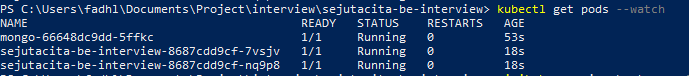

# Sejutacita BE Interview

This project is a simple CRUD user application to fulfill sejutacita interview process.

## Prerequisites

- Minikube
- Kubectl
- Docker


## Installation

Running mongo pods and initialize user data

```bash
kubectl apply -f .\kube\mongo-cfgmap.yaml
```

```bash
kubectl apply -f .\kube\mongo-pvc.yaml
```

```bash
kubectl apply -f .\kube\mongo-dply.yaml
```

```bash
kubectl apply -f .\kube\mongo-srvc.yaml
```

Check the pods is running by this command

```bash
kubectl get pods --watch
```

After mongo pods running properly with state RUNNING, run this command

```bash
kubectl exec -it [YOUR_MONGO_POD_NAME] sh docker-entrypoint-initdb.d/createuser.sh
```

Running the application

```bash
kubectl apply -f .\kube\app-dply.yaml
```

```bash
kubectl apply -f .\kube\app-srvc.yaml
```

If your the process success you can run this command

```bash
kubectl get pods --watch
```
 
And will get the result as the image below



## Usage

- Import postman collection and postman environtment from folder postman_collection.
- Run this command to get kube IP of the application.

```bash
minikube service sejutacita-be-interview --url
```

- Update value of base_url in postman environtment with IP that you get from the previous command.
- Use API Login with this user (username: admin, password: AdminUtama123@B).
- Put the access token on authorization bearer in other API.

